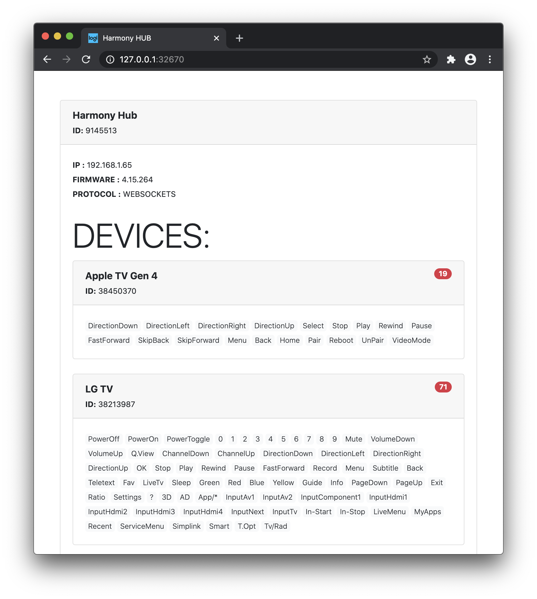

# Harmohy Hub Server

Сервер для Harmohy Hub. Сервис позволяет управлять устройствами, подключенные к Harmohy Hub, с помощью web-интерфейса или средствами POST-запросов.



# Деплой

Собираем Docker-образ:

```sh
docker build -t harmony-hub-server .
```

# Запуск:

```sh
docker run -d \
--name harmony-sever \
--restart always \
-p 32670:32670 \
-e HUB_IP='192.168.1.65' \
-e WEB_PORT='32670' \
-e WORKERS_NUM='2' \
-e HUB_PROTOCOL='WEBSOCKETS' \
harmony-hub-server
```

# Пример curl-запроса:

```sh
  curl http://192.168.1.65:32670/command \
    --request POST \
    --header 'Content-Type: application/json' \
    --data '{"id":"38450370","command":"DirectionDown"}'
```